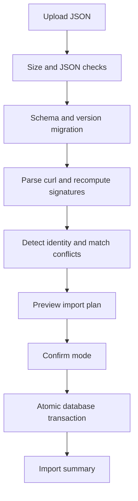

# Next feature implementation plan

## Implementation status — 2026-09-18

The first native import/export increment is now implemented:

- immutable UUIDv7 identities and migration backfill for endpoints/responses;
- deterministic native v1 JSON export for all or selected endpoints;
- default header/query secret redaction with affected endpoints forced disabled;
- checked-in JSON Schema and bounded semantic validation;
- create-only, UUID upsert, and clone modes;
- expiring preview token plus document digest;
- exact signature, response identity, and broad/narrow overlap analysis;
- warning acknowledgement and atomic transaction apply;
- dashboard, protected HTTP, and Artisan command entry points;
- regression coverage for round trips, idempotency, conflicts, redaction, auth, API, and CLI behavior.

Remaining Phase 1 hardening before declaring the entire phase complete:

- add historical-version migration fixtures when format v2 is designed;
- add browser-level drag/drop and focus-management coverage;
- add fault-injection coverage for a deliberately failed late transaction write;
- add large boundary/depth fixtures and PostgreSQL integration coverage in CI;
- decide whether import reports need persisted audit metadata before multi-user access is added.

## Executive decision

The next release must deliver **safe, versioned configuration import/export** before adding broader matching or simulation features. Portability is the foundation for backups, code review, CI fixtures, team sharing, migration, and every later interoperability feature.

The first increment should export and import MockDeck's native configuration only. OpenAPI, Postman, WireMock, Mockoon, and Hoverfly adapters should follow behind a stable internal document model rather than being mixed into the initial release.

## Current baseline after issue fixes

The fixed service now provides:

- deterministic conflict resolution by priority, then signature specificity, then endpoint ID;
- enabled/disabled endpoints and explicit priorities;
- exact duplicate-signature prevention in the dashboard;
- dashboard authentication and persistent protection for Livewire updates;
- production startup guards for placeholder application, database, and dashboard secrets;
- absolute HTTP/HTTPS URL validation and diagnostic `400` responses;
- origin-independent path/query signatures and copyable mock-host curls;
- non-fatal structured request logging with request IDs;
- bounded log reading across rotated files;
- endpoint and log filters plus responsive controls;
- automated regression tests and a repeatable Docker validation workflow.

Import/export must preserve these semantics. It must never trust imported hashes or silently create a conflict whose winner depends on database insertion order.

## Market and product research

| Service | Useful established behavior | Lesson for MockDeck |
|---|---|---|
| WireMock | JSON mappings, rich request matchers, explicit priority, scenarios, response templating, recording, verification, and admin APIs | Keep configuration file-friendly; preserve explicit priority; add state and recording only after the portable format is stable |
| Mockoon | One schema-validated JSON data file can represent an environment, routes, responses, variables, and data buckets; files can be shared, watched, used by CLI, and committed to Git | Publish a JSON Schema, make stable IDs first-class, and ensure the same artifact works in UI and CLI workflows |
| Postman mock servers | Saved examples are scored by matching inputs; private mocks and dynamic response behavior exist alongside collection portability | Show match/conflict diagnostics before import; keep secrets and access policy outside portable endpoint content |
| Prism | OpenAPI documents drive mock generation and request/response validation | Treat OpenAPI as a future adapter into the internal model, not as the native persistence schema |
| MockServer | Expectations support priorities, limited match counts, time-to-live, callbacks/forwarding, initialization files, and retrieval APIs | Keep priority now; design extension fields for lifecycle and rule features without making v1 import depend on them |
| Hoverfly | Capture/simulate workflows use portable simulation JSON that can be exported, edited, and imported | Native export should be deterministic and suitable for Git diffs; recording can later emit the same internal format |

Primary references reviewed:

- [WireMock standalone and JSON configuration](https://wiremock.org/docs/standalone/)
- [WireMock proxying and priorities](https://wiremock.org/docs/proxying/)
- [WireMock request journal and verification](https://wiremock.org/docs/verifying/)
- [Mockoon JSON data files and schema validation](https://mockoon.com/docs/latest/mockoon-data-files/data-files-location/)
- [Mockoon routes and response rules](https://mockoon.com/docs/latest/api-endpoints/http-routes/)
- [Mockoon stateful data buckets](https://mockoon.com/docs/latest/data-buckets/overview/)
- [Postman mock matching algorithm](https://learning.postman.com/docs/design-apis/mock-apis/matching-algorithm/)
- [MockServer creating expectations](https://www.mock-server.com/mock_server/creating_expectations.html)
- [Prism OpenAPI mock/validation project](https://github.com/stoplightio/prism)
- [Hoverfly simulation concepts](https://docs.hoverfly.io/en/latest/pages/keyconcepts/simulations.html)

## Phase 1: native import/export

### Goals

1. Export all endpoints or a selected subset with their responses.
2. Import a native file through a preview-first, atomic workflow.
3. Recompute every canonical signature and hash using current application code.
4. Detect exact and overlapping conflicts before any write.
5. Exclude deployment credentials and redact request secrets by default.
6. Provide equivalent dashboard, HTTP admin API, and Artisan CLI flows.
7. Make output deterministic so a semantically unchanged export has a stable Git diff.

### Non-goals for the first increment

- Importing third-party formats
- Exporting request logs
- Exporting dashboard credentials, application secrets, or database settings
- Synchronizing two live MockDeck instances
- Partial success that leaves a half-imported document
- Arbitrary script execution or response templating
- Reusing imported database IDs or imported hashes

## Native document contract

Use UTF-8 JSON with media type `application/vnd.mockdeck.config+json`. The top-level version is independent of the signature algorithm version.

Illustrative document:

```json
{
  "$schema": "https://mockdeck.local/schemas/config-v1.json",
  "format": "mockdeck",
  "format_version": 1,
  "exported_at": "2026-09-18T12:00:00Z",
  "generator": {
    "name": "MockDeck",
    "version": "1.1.0"
  },
  "options": {
    "secrets_redacted": true
  },
  "endpoints": [
    {
      "uuid": "018f37a0-10db-7c76-8791-e3d9b3849421",
      "name": "Create item",
      "enabled": true,
      "priority": 10,
      "request": {
        "curl": "curl --request POST 'https://api.example.test/v1/items' --header 'Content-Type: application/json' --data '{\"name\":\"Example\"}'",
        "signature_version": 2,
        "matching": {
          "exclude_cookies": false,
          "exclude_auth": true,
          "exclude_headers": false
        }
      },
      "responses": [
        {
          "uuid": "018f37a0-5100-7b64-9df0-9a1f5f90795c",
          "status": 201,
          "headers": {"Content-Type": "application/json"},
          "body": "{\"created\":true}",
          "delay_ms": 0,
          "weight": 1
        }
      ]
    }
  ]
}
```

### Contract rules

- `format` is exactly `mockdeck`.
- `format_version` is a positive integer and initially `1`.
- `uuid` is the stable portable identity; numeric database IDs are never exported.
- Endpoint and response arrays are sorted by UUID in export output.
- Header object keys are sorted case-insensitively before JSON encoding.
- JSON uses four-space indentation, unescaped slashes, unescaped Unicode, and a final newline.
- `normalized_curl` and `curl_hash` are not exported because they are derived data.
- `signature_version` declares how the source signature was built, but current code always parses and recomputes it during import.
- Unknown top-level or object properties produce warnings in v1; unknown required enum values produce errors.
- Timestamps are metadata only and do not influence idempotency.
- A hard limit applies to upload bytes, endpoint count, response count, string lengths, and JSON nesting depth.

## Data model changes

Add durable UUIDs before building exporters:

```text
mock_endpoints.uuid   UUID, unique, indexed, immutable
mock_responses.uuid   UUID, unique, indexed, immutable
```

Backfill existing rows in a migration using ordered chunks. Generate UUIDv7 values in model creation hooks. Do not derive UUIDs from database IDs because exported artifacts may be shared across installations.

Keep `signature_version` on endpoints. A later canonicalization change can add a `SignatureMigrator` and support multiple versions during a controlled transition.

No import-job table is required for synchronous v1 imports within the documented file limits. If large asynchronous imports become necessary, add an `import_runs` table later for progress and audit metadata.

## Service boundaries

Create these application services:

```text
app/Services/Config/
  ConfigDocument.php          immutable validated document DTO
  ConfigExporter.php          model -> deterministic document
  ConfigImporter.php          import orchestration and transaction
  ConfigValidator.php         JSON Schema plus semantic validation
  ConfigMigrator.php          format_version N -> current version
  ConflictDetector.php        UUID, exact-signature, and overlap analysis
  ImportPlan.php              immutable dry-run result
  SecretRedactor.php          request-header and curl credential handling
  ValueObjects/
    ImportMode.php
    ImportConflict.php
    ImportSummary.php
```

Controllers, Livewire components, and Artisan commands must call these services. They must not duplicate transformation or conflict rules.

## Export design

### Dashboard flow

1. Add checkboxes to endpoint cards and a select-all-for-current-filter control.
2. Open an Export dialog for `selected endpoints` or `all endpoints`.
3. Default `Redact secrets` to on and explain exactly what is removed.
4. Show endpoint/response counts and estimated size.
5. Generate a streamed JSON download with a filename such as `mockdeck-config-2026-09-18.json`.

### Secret handling

Default export redaction must cover:

- `Authorization` and `Proxy-Authorization`;
- `Cookie` and `Set-Cookie`;
- common API-key headers configured in `MOCK_EXPORT_SENSITIVE_HEADERS`;
- credentials embedded in query keys configured as sensitive;
- URL user information, although current URL validation already rejects it.

For a redacted header, remove its value and record a structured warning in export metadata. Do not silently replace it with a value that could accidentally match. If a redaction changes a header-inclusive request, export that endpoint as `enabled: false` and add `requires_secret_replacement: true`. The import preview must surface this state.

An explicit `Include sensitive values` option may be allowed only after a second confirmation. The downloaded file must carry `options.secrets_redacted: false`. Never export dashboard credentials or environment variables.

### API and CLI

Proposed routes, protected by dashboard access:

```text
POST /dashboard/config/exports
POST /dashboard/config/imports/preview
POST /dashboard/config/imports/apply
```

Proposed commands:

```bash
php artisan mockdeck:export --output=mockdeck.json
php artisan mockdeck:export --endpoint=<uuid> --redact-secrets
php artisan mockdeck:import mockdeck.json --dry-run
php artisan mockdeck:import mockdeck.json --mode=create-only
php artisan mockdeck:import mockdeck.json --mode=upsert
```

CLI output should be machine-readable with `--json` and return non-zero for validation/conflict failures.

## Import pipeline

The importer must use the same pipeline for UI, API, and CLI:



### Validation layers

1. **Transport:** MIME type, maximum bytes, valid UTF-8, JSON depth.
2. **Document:** format, supported version, JSON Schema, object counts.
3. **Field:** UUIDs, status range, delay bound, weight, priority, string sizes, header shape.
4. **Semantic:** curl parses, URL is HTTP/HTTPS, matching flags are valid, at least zero responses is allowed with a warning.
5. **Derived:** canonical string and hash recompute successfully using `CurlParser` and `CurlHasher`.
6. **Conflict:** portable UUID, exact signature, overlapping signature, duplicate response UUID.

Errors prevent confirmation. Warnings require explicit acknowledgement but may be applied.

### Import modes

| Mode | UUID exists | UUID absent, exact signature exists | No conflict |
|---|---|---|---|
| `create-only` | Error | Error | Create |
| `upsert` | Update matching UUID | Error unless same endpoint | Create |
| `clone` | Generate new UUID | Require priority/state choice | Create with new UUID |

Do not implement destructive `mirror` mode in v1. A future mirror would delete local records not present in the file and requires a separate confirmation, backup export, and audit trail.

### Conflict policy

The preview must distinguish:

- **identity update:** same UUID;
- **exact signature collision:** same selected variant hash after recomputation;
- **origin-equivalent collision:** different upstream origin but the same canonical path/query request;
- **overlap:** imported generic variant could match the same live request as an existing specific variant;
- **response identity collision:** response UUID belongs to another endpoint;
- **redacted/disabled:** imported request needs operator input before safe enablement.

For overlaps, show both endpoint names, variants, priorities, and predicted winner using the current matcher ordering. Require the operator to keep disabled, change priority, or cancel. Never silently manipulate priority.

### Transaction behavior

- Build and validate the complete `ImportPlan` outside the transaction.
- On confirmation, start one database transaction.
- Lock existing rows referenced by UUID or collision checks.
- Recheck conflicts inside the transaction to prevent a time-of-check/time-of-use race.
- Create/update endpoints and responses.
- Delete responses missing from an upserted endpoint only if the operator selected `replace responses`; default behavior is merge-by-UUID.
- Commit only after all rows succeed.
- Return counts for created, updated, skipped, disabled, and warning totals.
- On any exception, roll back everything and return a correlation/request ID.

## UI/UX specification

### Import screen

1. Drag/drop or file-picker panel accepting `.json`.
2. Progress state while parsing; no write occurs.
3. Summary cards: endpoints, responses, creates, updates, conflicts, warnings.
4. Filterable preview table with status chips.
5. Expandable conflict details showing local versus imported configuration.
6. Import-mode selector with plain-language consequences.
7. Confirmation button disabled while errors exist.
8. Final result screen with counts and a downloadable JSON report.

Accessibility requirements:

- file input remains keyboard accessible;
- status is not communicated by color alone;
- validation summary links to the affected row;
- focus moves to the validation summary after preview;
- progress and completion messages use appropriate live regions.

### Export screen

- Preserve active endpoint filters while selecting.
- Display selection count persistently.
- Explain redaction before download.
- Keep the primary action labeled `Export JSON`, not a generic `Continue`.
- Provide a copyable CLI equivalent for repeatable workflows.

## Security requirements

- Parse JSON only; never accept PHP serialization or YAML object tags.
- Do not execute curl, scripts, templates, callbacks, or imported URLs.
- Enforce request body, response body, file, record-count, and nesting limits.
- Validate response header names and reject CR/LF in names or values.
- Use constant-time dashboard credential comparison as already implemented.
- Protect preview/apply endpoints with dashboard access, CSRF, and conservative rate limits.
- Bind apply requests to a server-generated, expiring import-plan token so a client cannot alter the previewed document.
- Store a SHA-256 digest of the uploaded bytes with the plan and recheck it at apply time.
- Do not write uploaded documents to a public disk.
- Log import metadata and counts, never the full document or secret values.
- Escape all preview output and avoid rendering response bodies as HTML.

## Tests for Phase 1

### Unit

- deterministic ordering and byte-identical repeated export;
- schema validation for every required field and bound;
- format migration from supported historical fixtures;
- secret redaction for headers, cookies, auth, and configured key names;
- canonical/hash recomputation ignores forged imported derived values;
- conflict classification and predicted winner;
- every import-mode decision matrix branch.

### Feature

- export all and selected endpoints;
- unauthenticated export/import blocked;
- dry-run performs no writes;
- create-only happy path;
- UUID upsert is idempotent when run twice;
- exact collision rejects atomically;
- overlap warning requires an explicit choice;
- malformed curl rejects the whole import;
- response merge and replace behavior;
- redacted endpoints arrive disabled;
- oversized/deep documents reject before model hydration;
- transaction rollback after an injected late failure;
- CLI and HTTP flows produce equivalent summaries.

### Contract fixtures

Commit fixtures under `tests/Fixtures/Config/v1/`:

```text
minimal.json
complete.json
redacted.json
exact-conflict.json
overlap-warning.json
invalid-schema.json
invalid-curl.json
future-version.json
```

Validate exported documents against a checked-in `resources/schemas/mockdeck-config-v1.schema.json` in CI.

## Acceptance criteria

Phase 1 is complete only when:

- exporting the same database twice produces byte-identical endpoint/response content apart from an optionally omitted timestamp;
- importing a clean export into an empty database reproduces endpoint behavior and response weights;
- importing the same file twice in `upsert` mode is idempotent;
- no imported hash or numeric ID is trusted;
- exact and overlapping conflicts are visible before apply;
- one invalid endpoint causes zero database writes;
- redacted secrets never appear in the artifact, logs, validation errors, or HTML;
- UI, API, and CLI share the same validator/importer services;
- JSON Schema, examples, CLI help, and operator documentation ship together;
- `make validate` and the import/export fixture suite pass.

## Suggested conventional commit sequence

Implement Phase 1 as reviewable slices:

```text
feat(config): add stable endpoint and response uuids
feat(config): define versioned native document schema
feat(export): add deterministic redacted config exporter
feat(import): add schema and semantic validation pipeline
feat(import): preview conflicts and import modes
feat(import): apply configuration atomically
feat(ui): add config import and export workflows
feat(cli): add config import and export commands
test(config): cover round trips conflicts and redaction
docs(config): document portable configuration workflows
```

## Delivery order after import/export

### Phase 2: selective matching rules

Add path templates, per-header/query rules, JSONPath/body matchers, regex, and explicit `ignore` lists. Replace the fixed five-variant query strategy with a two-stage candidate index and scored predicate evaluation. Preserve explainable match diagnostics.

### Phase 3: deterministic response rules

Allow response selection by header/query/body predicates before weighted fallback. Display why a response was selected and test ordering/conflicts.

### Phase 4: stateful scenarios

Add named scenarios with required/current/next state, reset controls, isolation keys, and concurrency-safe transitions. Model this after WireMock scenarios and Mockoon data-backed state without coupling state to request logs.

### Phase 5: templating and reusable data

Add a sandboxed response template language, variables, reusable data sets, time/random helpers with seed control, and strict output escaping. Do not permit arbitrary PHP or shell execution.

### Phase 6: recording and proxying

Provide allowlisted upstream recording, previewed secret redaction, deduplication, and conversion into the native portable document. Protect against SSRF with scheme, host, DNS/IP, redirect, and port policies.

### Phase 7: ecosystem adapters

Import OpenAPI examples first, then Postman collections/examples, WireMock mappings, Mockoon environments, and Hoverfly simulations. Adapters convert into `ConfigDocument`; they never write models directly. Export adapters can be added only where semantics map without silent loss.

### Phase 8: verification and collaboration

Add request-count assertions, unmatched-request reports, scenario resets, team workspaces, role-based access, audit trails, and optional Git-backed config sync.

## Architectural guardrails

- Keep invocation latency independent from import/export document size.
- Keep raw request logs out of the relational domain tables.
- Keep canonicalization centralized in `CurlNormalizer`.
- Keep all conflict ordering centralized in `EndpointMatcher` and `ConflictDetector` using the same comparison rules.
- Version transport format separately from signature format.
- Prefer stable UUID references over names or database IDs.
- Treat secrets, templates, proxying, and third-party conversion as explicit trust boundaries.
- Require a migration and compatibility note for any canonicalization change.
