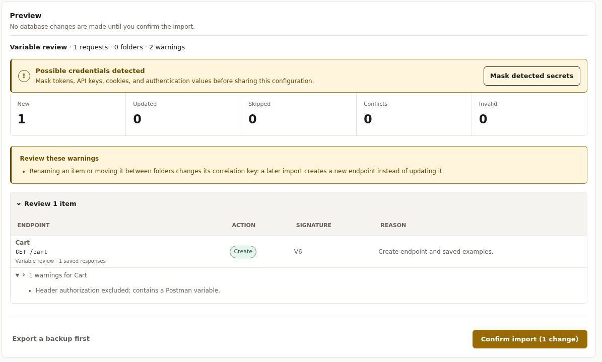
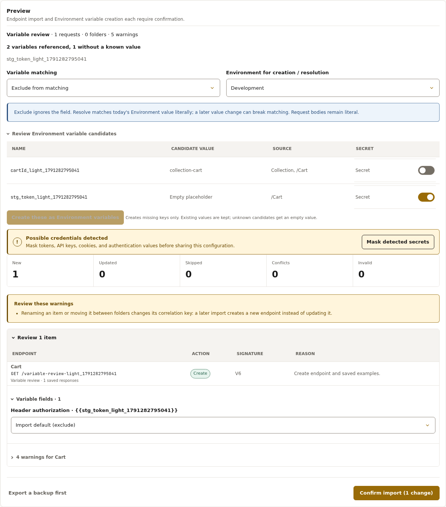
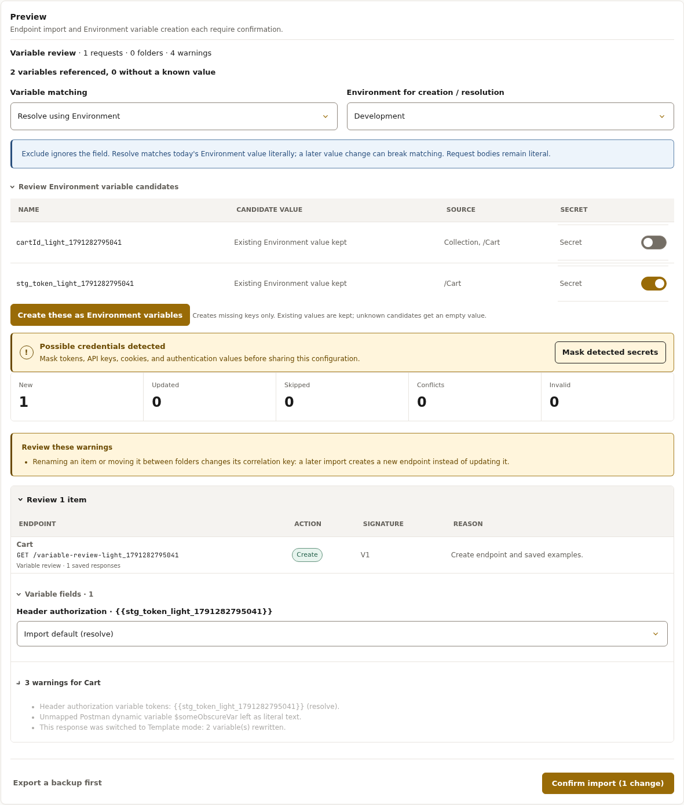
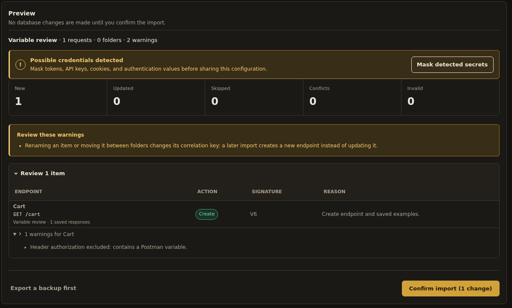
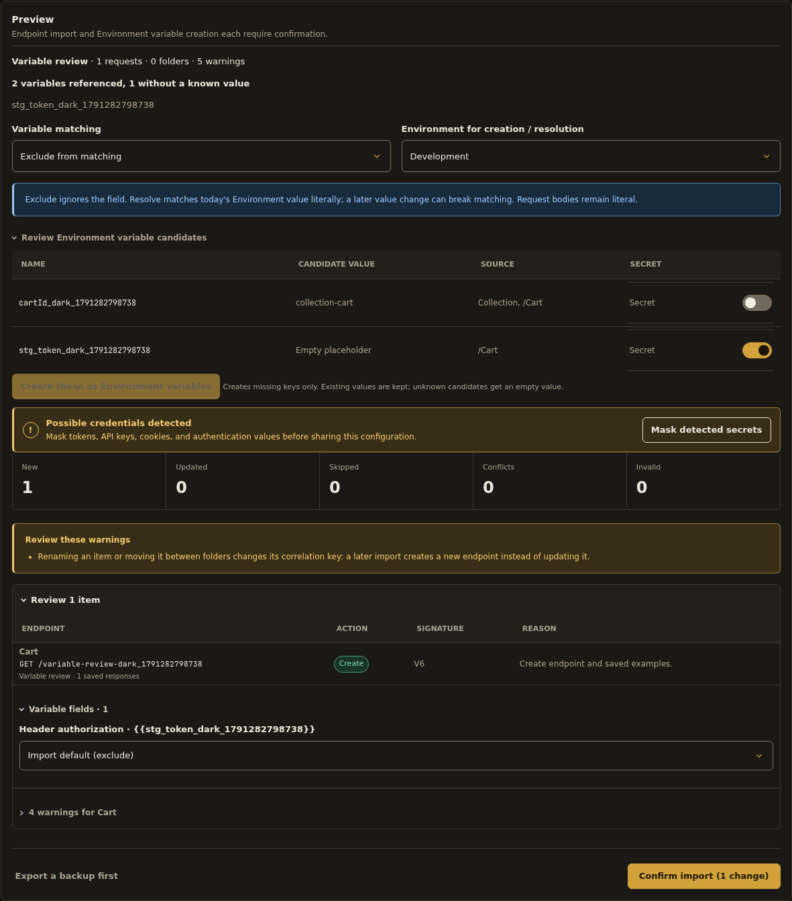
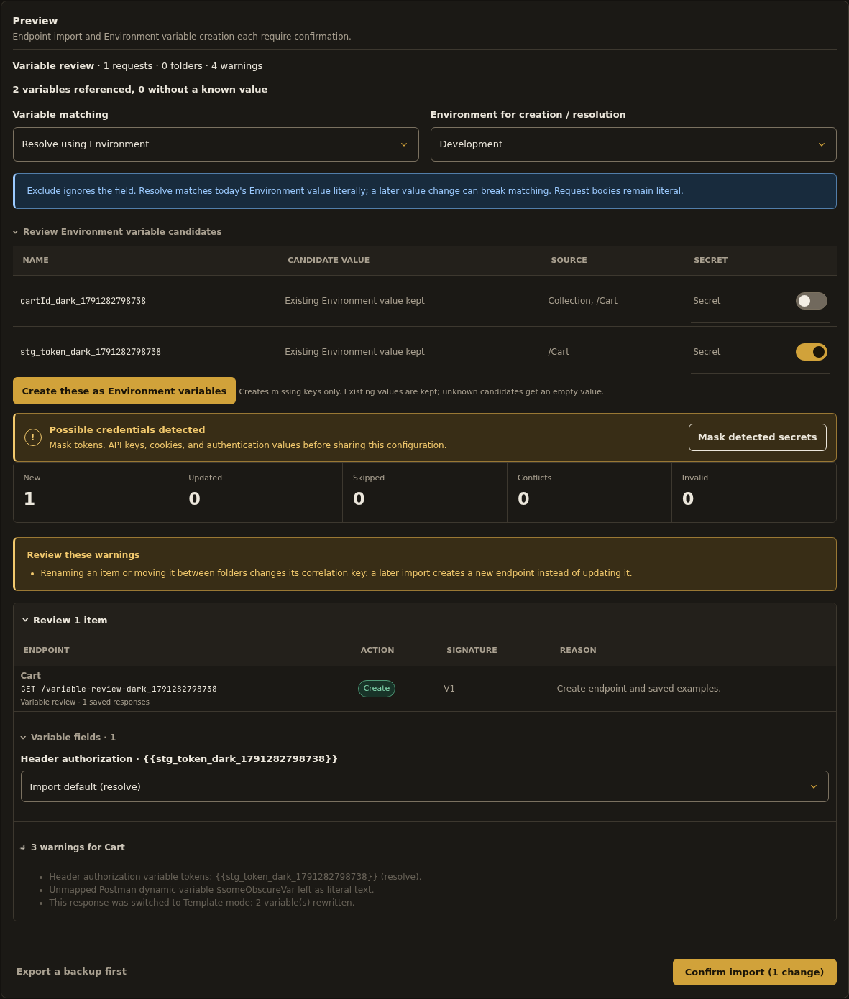

# Postman variable refinement — implementation report

Implemented A1–A6 on the existing Postman v2.1 import. Request bodies retain literal matching; script handling is unchanged.

## Discovery and compatibility

Before this change, variable-bearing headers/query fields were auto-excluded through `excluded_headers`/`excluded_query_params`, with generic preview warnings. The shared Faker catalog is `App\Services\Templates\FakerMethodCatalog`. Responses already supported imported `body_mode` and `template` fields.

The companion Environment upload had been deferred in Wave 3, so this pass adds it. Environment creation previously existed through the encrypted model and interactive/API handlers, but no shared creation service or sensitive-name helper existed. These are now consolidated in `App\Services\Environments\EnvironmentVariableWriter`; both existing creation surfaces reuse it. Sensitive names default to secret when they contain token, secret, password, key, credential, or authorization.

No migration is needed. Native format remains **1.5**: the existing extensible `external_source` metadata and response template fields carry the additions. Optional provenance is documented in the native schema and validated on import. Existing imports remain unchanged until re-imported using **Update matching**.

## What changed

| Item | Result |
| --- | --- |
| A1 | Root and folder `variable[]` declarations are collected with descendant-only folder scope. A companion Environment file wins over embedded values, with a preview warning. Conflicting folder values remain unknown rather than choosing one global value. |
| A2 | Exact original tokens are retained in `external_source.variable_provenance` and displayed beside excluded fields in Matching and in import preview. Masking preserves token names without retaining detected credential values in annotations. |
| A3 | One combined candidate list includes declarations plus otherwise-unknown referenced names. Operators choose an Environment, review values and secret toggles, and explicitly confirm creation. Unknown values become empty strings; existing Environment variables are kept. Creation is separate from endpoint import and its Undo batch. |
| A4 | Exclude remains the default. Resolve uses the selected MockDeck Environment's current values, with per-header/query overrides. Missing values block changes being imported until created or switched to Exclude. Resolved literals are frozen at preview time; later Environment changes require a new preview/import to change matching. |
| A5 | Saved-response user variables become `{{env.name}}` and Template mode, with conversion counts in preview. JSON responses and text/HTML responses are supported. Request bodies remain literal and retain their existing warning. |
| A6 | Eleven common dynamic variables map through the shared Faker catalog. Unknown dynamic variables remain literal with named warnings. |

Embedded/companion values are candidates for explicit creation. Resolve reads the chosen **MockDeck Environment**, rather than silently importing companion values into it. Existing keys are never overwritten by candidate creation.

For response text/HTML, the compiler accepts a JSON-string root and the renderer emits its text bytes. Object/array template behavior remains unchanged. If a rewritten response cannot safely compile using the existing template grammar, it stays static with a warning; the importer does not silently corrupt it. Unknown-only dynamic responses stay static; unknown tokens alongside supported conversions remain literal inside the generated template.

## Dynamic-variable mapping

| Postman token | MockDeck template token | Semantics |
| --- | --- | --- |
| `{{$guid}}` | `{{string.uuid}}` | UUID |
| `{{$randomUUID}}` | `{{string.uuid}}` | UUID |
| `{{$timestamp}}` | `{{date.epochS}}` | Current Unix seconds |
| `{{$isoTimestamp}}` | `{{date.now}}` | Current UTC ISO timestamp |
| `{{$randomEmail}}` | `{{internet.email}}` | Generated email |
| `{{$randomInt}}` | `{{number.int(0,1000)}}` | Integer from 0 through 1000 |
| `{{$randomFirstName}}` | `{{person.firstName}}` | First name |
| `{{$randomLastName}}` | `{{person.lastName}}` | Last name |
| `{{$randomFullName}}` | `{{person.fullName}}` | Full name |
| `{{$randomCity}}` | `{{location.city}}` | City |
| `{{$randomCountry}}` | `{{location.country}}` | Country |

`date.now` and `date.epochS` are added to the shared catalog, providing current-time semantics rather than approximating them with a randomly generated date. All dynamic names outside this table are unmapped. The tested `{{$someObscureVar}}` stays literal with a warning naming it.

## Before/after preview

These captures use synthetic fixtures, without the uploaded collection's private values. Before images show the original preview. After images show candidate review in Exclude mode and the resulting Resolve-mode preview after explicit creation. Both themes were inspected.

### Light theme

Before:



After — candidate review and default Exclude mode:



After — Resolve mode and per-field override:



### Dark theme

Before:



After — candidate review and default Exclude mode:



After — Resolve mode and per-field override:



## Contract for the companion script-handling pass

`PostmanMapper::map()` returns **`document['variable_candidates']`**. Each entry has:

```text
name: string
value: string|null
known: bool
is_secret: bool
sources: list<string>
scope_conflict: bool
exists_in_environment: bool
```

This is the combined embedded/companion/reference inventory, not just names encountered in headers. It includes request-body and saved-response references, and deliberately does not scan or execute scripts. Folder scope is retained during traversal; conflicting scopes are flagged in the consolidated inventory. `ImportPlan.metadata['variable_candidates']` exposes the same inventory for review, with secret `value` fields replaced by null. Full candidate values remain in the server-side cached mapped document for explicit creation. Per-item `variable_provenance` becomes preview `variable_fields` and portable `external_source.variable_provenance`.

The later pass can consume this inventory directly. Script-only variable extraction belongs to that later pass and has not been added here.

## Validation

- Full PHPUnit suite: **273 tests, 2,021 assertions passed**.
- `make frontend-test`: **48 tests passed**.
- Design-token validation, Composer strict validation and Pint passed.
- Playwright layout smoke passed in both themes.
- Postman-variable browser regression passed in both themes at **1440, 1024, 767 and 390 px**, including explicit confirmation, creation, Resolve-mode preview, no page overflow, import and live response rendering.
- Acceptance coverage includes empty secret placeholders, companion prefilled values, embedded-only declarations, companion precedence warnings, scoped folders, original Matching annotations, per-field overrides, dynamic email rendering, all eleven mappings, unmapped literals, request-body preservation, and native provenance/template round trips.
- Missing resolution values cannot be bypassed by applying a cached plan. Create-only skipped entries do not block a no-op import solely because they have unresolved values.

`make validate` passed Compose configuration, design tokens and frontend tests, then stopped at the Docker image-build step because this workspace cannot access the Docker daemon. Composer, Pint and PHPUnit were run successfully outside that blocked build. An image build must still be verified on the deployment host.

## Apply the update

The changed-files archive is based on commit `a067945` (the preceding copied-curl/signature fix). From the MockDeck repository root:

```bash
unzip -o /path/to/MockDeck-Postman-Variables-Update.zip -d .
docker compose up -d --build --force-recreate app callback-worker nginx
```

Hard-refresh the dashboard. Re-import existing collections with **Update matching** to apply provenance and response-template conversions. Review candidates and explicitly create missing Environment keys before choosing Resolve for those fields. Back up configuration before updating imported endpoints. No new migration or Composer dependency is introduced by this update.
